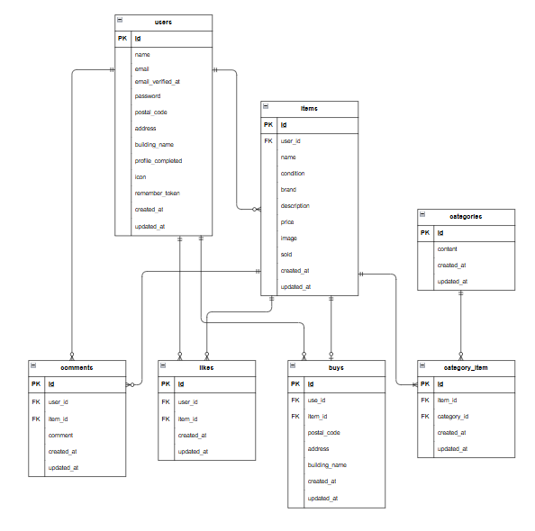

# coachtechフリマ

## 概要
ユーザーが会員登録することで商品の出品、購入ができるフリマアプリです。

## 環境構築
**Dockerビルド**
1. `git clone git@github.com:tanakami315/MATTER-flea-market.git`
2. DockerDesktopアプリを立ち上げる
3. `docker-compose up -d --build`

**Laravel環境構築**
1. `docker-compose exec php bash`
2. `composer install`
3. 「.env.example」ファイルをコピーして 「.env」ファイルを作成。
4. .envで以下の環境変数を変更
``` textit 
DB_CONNECTION=mysql
DB_HOST=mysql
DB_PORT=3306
DB_DATABASE=laravel_db
DB_USERNAME=laravel_user
DB_PASSWORD=laravel_pass

MAIL_FROM_ADDRESS=test@example.com

STRIPE_KEY=your_stripe_key
STRIPE_SECRET=your_stripe_secret
※Stripeのテスト用APIキーを設定してください。
```
5. アプリケーションキーの作成
``` bash
php artisan key:generate
```

6. キャッシュの削除
```bash
php artisan config:clear
```

7. マイグレーションの実行
``` bash
php artisan migrate
```

8. シーディングの実行
``` bash
php artisan db:seed
```

9. 保存したファイルへのリンク作成
```bash
php artisan storage:link
```

## 単体テスト
1. rootユーザ（管理者）でログイン
``` bash
mysql -u root -p
```

2. テスト用データベースの作成
``` bash
CREATE DATABASE test_1;
```
3. 「.env」ファイルをコピーして 「.env.testing」ファイルを作成。

4. .env.testingで以下の環境変数を変更

```env
APP_ENV=testing
APP_KEY=

DB_DATABASE=test_1
DB_USERNAME=root
DB_PASSWORD=root
```
※ APP_KEYは空のままにしてください。  
後述のコマンドでテスト用キーを生成します。

5. テスト用アプリケーションキーの作成
```bash
php artisan key:generate --env=testing
```

6. キャッシュの削除
```bash
php artisan config:clear
```

7. テスト用テーブルの作成
```bash
php artisan migrate --env=testing
```

8. テストの実行
```bash
vendor/bin/phpunit tests/Feature/RegisterTest.php
vendor/bin/phpunit tests/Feature/LoginTest.php
vendor/bin/phpunit tests/Feature/LogoutTest.php
vendor/bin/phpunit tests/Feature/ItemTest.php
vendor/bin/phpunit tests/Feature/MylistTest.php
vendor/bin/phpunit tests/Feature/SearchTest.php
vendor/bin/phpunit tests/Feature/DetailTest.php
vendor/bin/phpunit tests/Feature/LikeTest.php
vendor/bin/phpunit tests/Feature/CommentTest.php
vendor/bin/phpunit tests/Feature/PurchaseTest.php
vendor/bin/phpunit tests/Feature/PurchaseMethodTest.php
vendor/bin/phpunit tests/Feature/AddressTest.php
vendor/bin/phpunit tests/Feature/ProfileTest.php
vendor/bin/phpunit tests/Feature/ProfileEditTest.php
vendor/bin/phpunit tests/Feature/SellTest.php
vendor/bin/phpunit tests/Feature/VerifyEmailTest.php
```

## 使用技術(実行環境)
- PHP 8.1.34
- Laravel 8.83.8
- MySQL 8.0.26

## ER図


## URL
- 開発環境：http://localhost
- Mailhog：http://localhost:8025